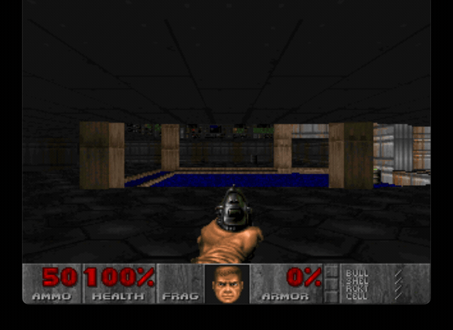

# DOOM Ruby

A faithful ruby port of the DOOM (1993) rendering engine to Ruby.



## Features

- Pure Ruby implementation of DOOM's BSP rendering engine
- Accurate wall, floor, and ceiling rendering with proper texture mapping
- Sprite rendering with depth-correct clipping
- Original DOOM lighting and colormap support
- Mouse look and WASD movement controls
- Supports original WAD files (shareware and registered)

## Installation

```bash
gem install doom
```

## Quick Start

Just run `doom` - it will offer to download the free shareware version:

```bash
doom
```

Or specify your own WAD file:

```bash
doom /path/to/doom.wad
```

## Controls

| Key | Action |
|-----|--------|
| W / Up Arrow | Move forward |
| S / Down Arrow | Move backward |
| A | Strafe left |
| D | Strafe right |
| Left Arrow | Turn left |
| Right Arrow | Turn right |
| Mouse | Look around (click to capture) |
| Escape | Release mouse / Quit |

## Requirements

- Ruby 3.1 or higher
- Gosu gem (for window/graphics)
- SDL2 (native library required by Gosu)

### Installing SDL2

**macOS:**
```bash
brew install sdl2
```

**Ubuntu/Debian:**
```bash
sudo apt-get install build-essential libsdl2-dev libgl1-mesa-dev libfontconfig1-dev
```

**Fedora:**
```bash
sudo dnf install SDL2-devel mesa-libGL-devel fontconfig-devel gcc-c++
```

**Arch Linux:**
```bash
sudo pacman -S sdl2 mesa
```

**Windows:**
No additional setup needed - the gem includes SDL2.

## Development

```bash
git clone https://github.com/khasinski/doom-rb.git
cd doom-rb
bundle install
ruby bin/doom doom1.wad
```

Run specs:

```bash
bundle exec rspec
```

## Technical Details

This implementation includes:

- **BSP Traversal**: Front-to-back rendering using the map's BSP tree
- **Visplanes**: Floor/ceiling rendering with R_CheckPlane splitting
- **Drawsegs**: Wall segment tracking for proper sprite clipping
- **Texture Mapping**: Perspective-correct texture coordinates
- **Lighting**: Distance-based light diminishing with colormaps

## Legal

DOOM is a registered trademark of id Software LLC. This is an unofficial fan project.

The shareware version of DOOM (Episode 1) is freely distributable. For the full game,
please purchase DOOM from [Steam](https://store.steampowered.com/app/2280/Ultimate_Doom/),
[GOG](https://www.gog.com/pl/game/doom_doom_ii), or other retailers.

## License

GPL-2.0 - Same license as the original DOOM source code.

## Author

Chris Hasinski ([@khasinski](https://github.com/khasinski))
