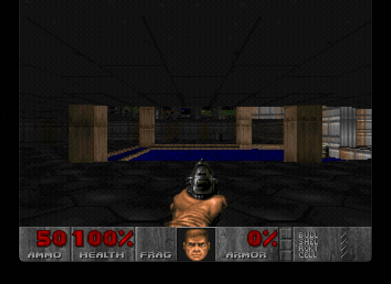

# DOOM Ruby

A faithful port of the DOOM (1993) engine to Ruby. Play original WAD files with
the classic software renderer, a hardware rasterizer, or a GPU ray tracer, in
single-player or multiplayer.



## Features

- **Three renderers**: Classic BSP software rendering, OpenGL rasterization, and GPU ray tracing
- **Dynamic lighting**: Projectile, explosion, emissive-floor, flashlight, shadow, and fog effects in the ray tracer
- **Multiplayer**: Authoritative server/client play and deterministic peer-to-peer lockstep, with co-op and deathmatch
- **Classic rendering**: BSP traversal, visplanes, drawsegs, sprite clipping, and sky rendering matching Chocolate Doom
- **Combat**: Hitscan weapons (pistol, shotgun, chaingun), melee (fist, chainsaw), projectile rockets with splash damage
- **Items**: Weapons, ammo, health, armor, keys -- all pickupable with correct DOOM behavior
- **Movement**: Momentum-based physics with friction, smooth step transitions, wall sliding, view bob
- **HUD**: Full status bar with ammo, health, armor, face, weapon selector, key cards, small ammo counts
- **Effects**: Animated textures (NUKAGE, SLADRIP), sector light effects (flickering, glowing, strobing), scrolling walls
- **Monsters**: Death animations, solid collision, HP tracking
- **Compatibility**: Supports original WAD files (shareware and registered), YJIT-optimized

## Installation

```bash
gem install doom
```

## Quick Start

Just run `doom` -- it will offer to download the free shareware version:

```bash
doom
```

Or specify your own WAD file:

```bash
doom /path/to/doom.wad
```

## Controls

| Key | Action |
|-----|--------|
| W / Up Arrow | Move forward |
| S / Down Arrow | Move backward |
| A | Strafe left |
| D | Strafe right |
| Left Arrow | Turn left |
| Right Arrow | Turn right |
| Mouse | Look around (click to capture) |
| Left Click / X / Shift | Fire weapon |
| Space / E | Use (open doors) |
| 1-7 | Switch weapons |
| M | Toggle automap |
| R | Cycle classic, rasterizer, and ray-tracing renderers |
| Z | Toggle debug overlay |
| Escape | Release mouse / Quit |

## Renderers

Select a renderer when starting the game:

```bash
doom --renderer=classic /path/to/doom.wad
doom --renderer=rasterizer /path/to/doom.wad
doom --renderer=raytracing /path/to/doom.wad
```

Press `R` during play to switch between them without restarting the simulation.

- `classic` is the pixel-accurate software BSP renderer.
- `rasterizer` builds a textured 3D world and draws it through Gosu's OpenGL context with a depth buffer.
- `raytracing` traces primary and shadow rays on the GPU using a stackless BVH. It includes dynamic lights, hard shadows, emissive nukage, fog, and a flashlight. It does not require dedicated hardware ray-intersection units.

The ray tracer uses a hybrid raster pass for sprites and does not yet implement
reflections or indirect light bounces. Fog and the flashlight can be toggled in
the Options menu. See [Modern renderers](docs/modern-renderer.md) for implementation
details and current limitations.

## Multiplayer

For an authoritative session suitable for more players over the internet, run
a headless server and connect clients to it:

```bash
doom --serve --players=4 --port=5029 /path/to/doom.wad
doom --join=server.example.com:5029 /path/to/doom.wad
```

For a small LAN, the original-style deterministic lockstep mode is also
available:

```bash
doom --host --players=2 --port=5029 /path/to/doom.wad
doom --connect=192.168.1.10:5029 /path/to/doom.wad
```

Add `--deathmatch` to host or serve a deathmatch. `--frags=N` sets its frag
limit. Every participant must use the same WAD.

## Frame rate

Frame generation is decoupled from presentation: the engine renders as fast as
it can and only presents to the display at its refresh rate, so the reported
FPS is not clamped to vsync. The debug overlay (`Z`) shows both numbers --
frames generated, and frames actually shown alongside the display's refresh
rate.

Turn it off with `UNCAPPED FPS` in the options menu, or start with `--vsync`
to present every frame the old way.

## Requirements

- Ruby 3.1+ (Ruby 4.0 with YJIT recommended for best performance)
- Gosu gem (for window, sound, and graphics)
- SDL2 (native library required by Gosu)
- OpenGL 3.3 or newer for the rasterizer and ray tracer

### Installing SDL2

**macOS:**
```bash
brew install sdl2
```

**Ubuntu/Debian:**
```bash
sudo apt-get install build-essential libsdl2-dev libgl1-mesa-dev libopenal-dev libsndfile1-dev libmpg123-dev libfontconfig1-dev
```

**Fedora:**
```bash
sudo dnf install SDL2-devel mesa-libGL-devel fontconfig-devel gcc-c++
```

**Arch Linux:**
```bash
sudo pacman -S sdl2 mesa
```

**Windows:**
No additional setup needed -- the gem includes SDL2.

## Development

```bash
git clone https://github.com/khasinski/doom.git
cd doom
bundle install
ruby bin/doom
```

Run specs:

```bash
bundle exec rspec
```

### Benchmarking

```bash
ruby bench/benchmark.rb                     # without YJIT
ruby --yjit bench/benchmark.rb              # with YJIT
ruby bench/benchmark.rb --compare           # side-by-side
ruby bench/benchmark.rb --profile           # CPU profile with StackProf
```

## Technical Details

- **BSP Traversal**: Front-to-back rendering using the map's BSP tree with R_CheckBBox culling
- **Visplanes**: Floor/ceiling rendering with R_CheckPlane splitting and span-based drawing
- **Drawsegs**: Wall segment tracking for proper sprite clipping (silhouette system)
- **Texture Mapping**: Perspective-correct ray-seg intersection with non-power-of-2 support
- **Lighting**: Distance-based light diminishing with wall and flat colormaps
- **Sky Rendering**: Chocolate Doom sky hack (worldtop = worldhigh) with correct placement
- **Movement Physics**: Continuous-time momentum/friction matching Chocolate Doom's P_XYMovement
- **Hitscan**: Ray tracing against walls and monster bounding circles
- **Projectiles**: Physical rockets with wall/monster collision and splash damage

## Performance

With Ruby 4.0 and YJIT enabled, the renderer achieves 80-130 FPS on E1M1 (Apple Silicon). See [docs/performance-profiling.md](docs/performance-profiling.md) and [docs/yjit-vs-zjit.md](docs/yjit-vs-zjit.md) for detailed analysis.

## Legal

DOOM is a registered trademark of id Software LLC. This is an unofficial fan project.

The shareware version of DOOM (Episode 1) is freely distributable. For the full game,
please purchase DOOM from [Steam](https://store.steampowered.com/app/2280/Ultimate_Doom/),
[GOG](https://www.gog.com/pl/game/doom_doom_ii), or other retailers.

## License

GPL-2.0-only -- Same license as the original DOOM source code.

## Author

Chris Hasinski ([@khasinski](https://github.com/khasinski))
